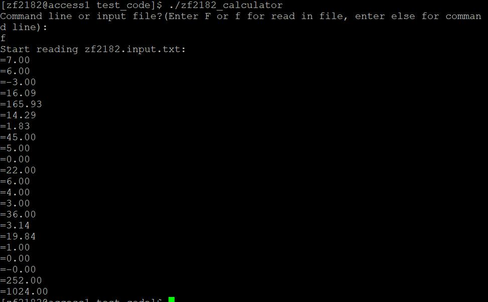
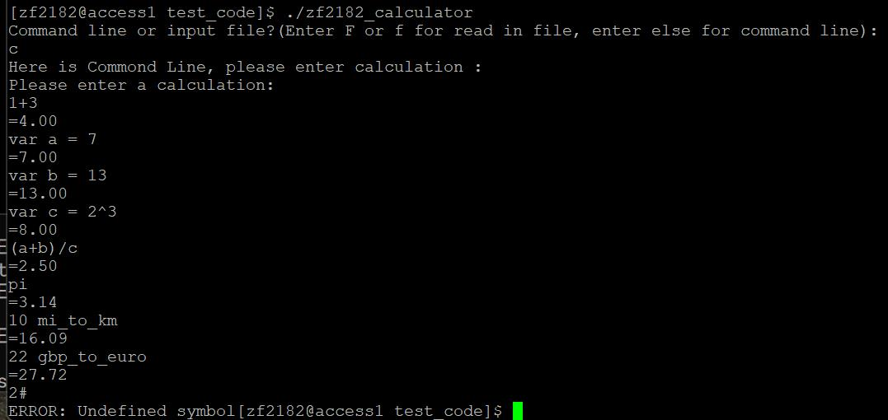

# Flex and Bison Calaulator calculator
## Description
A extended calculator using flex and bison.

| File | Description |
| ------ | ----------- |
| calc.l  | lexical rules |
| calc.y | grammar rules |
| util1.h    | functons for calculator(eg. variables setting...) |
| util.h    | functions for calculator(eg. MI_TO_KM, MOD...) |
| input.txt | the file calculator would read |

# How to compile
## In Window 
```
bison -d cal.y
flex calc.l
g++ lex.yy.c calc.tab.c -o calculator
```
or
```
make.sh
```
## In Linux
```script
bison -d cal.y
flex calc.l
g++ lex.yy.c calc.tab.c -o calculator
```
or
```
./make.sh
```

# How to run
## In Windows
```
calculator
```
## In Linux
```
 ./calculator
```

# Result
## Read in file

## Read in Command Line


type int "exit", "quit", "EXIT" or "QUIT" to exit.